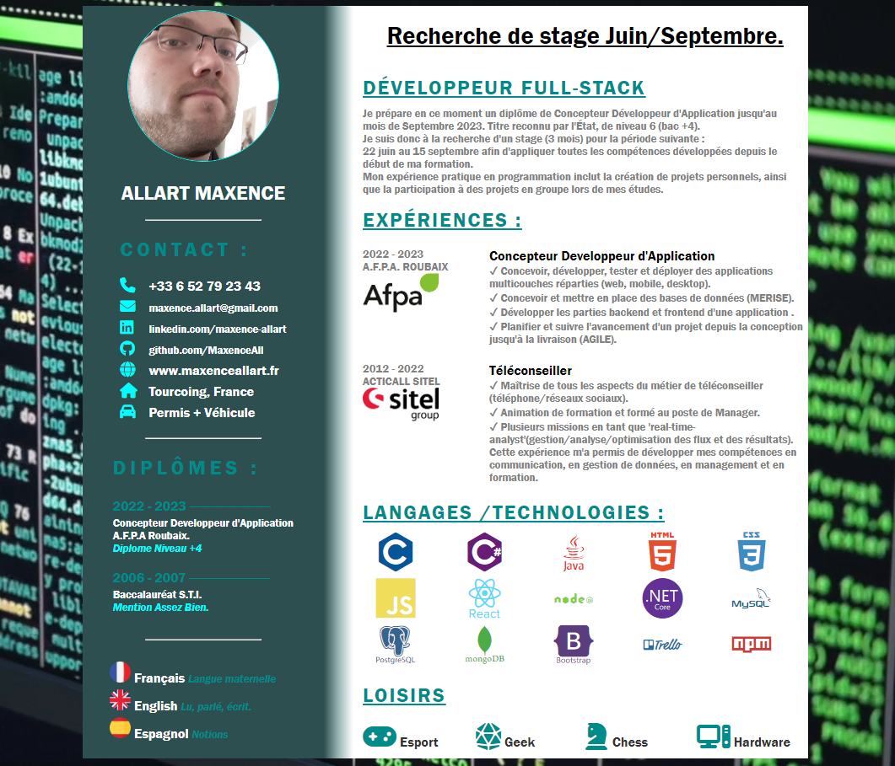
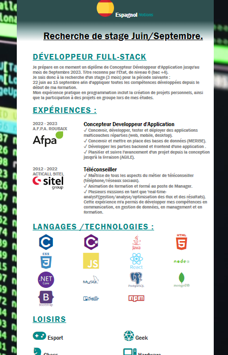

Bienvenue sur la version HTML de mon Curriculum Vitae.

Pour information, ce "projet" était un support pour re-découvrir le CSS/HTML.
CSS/HTML qui a bien changé depuis mes premiers début en 2006 :-).

Petit aperçu desktop:

Petit aperçu mobile:

        <h1 style="font-size: 24px; margin-bottom: 10px;">Allart Maxence</h1>
        
Concepteur Développeur d'Application

        
<strong>Email:</strong> maxence.allart@gmail.com

        
<strong>Phone:</strong> (+33) 652792343

        
<strong>Website:</strong> www.maxenceallart.fr

        
<strong>Address:</strong> Tourcoing, France.

